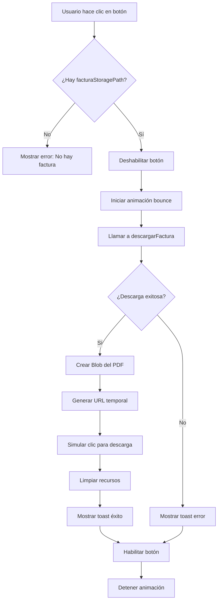

# Botón de Descarga de Factura en Detalle de Orden

## Descripción
Se agregó un botón de descarga al lado de la información de la factura en el detalle de una orden. Esto permite a cualquier usuario con acceso al detalle de la orden descargar el PDF de la factura asociada de manera rápida y sencilla.

## Cambios Implementados

### 1. Hook `useOrdenTrabajo.ts`

#### Modificaciones en `getOrdenById`:

**Query adicional para obtener la factura:**
```typescript
const [itemsRes, pagosRes, historialRes, ordenCopiadoRes, facturaRes] = await Promise.all([
  // ... otras queries ...
  // Obtener la factura activa (última creación o reemplazo)
  supabase
    .from('facturas_historial')
    .select('factura_storage_path, numero_factura, monto_total, created_at')
    .eq('orden_id', id)
    .in('tipo_operacion', ['creacion', 'reemplazo'])
    .order('created_at', { ascending: false })
    .limit(1)
    .maybeSingle(),
]);
```

**Agregado al return:**
```typescript
return {
  ...orden,
  items: itemsRes.data as OrdenTrabajoItemFull[],
  pagos: pagosRes.data,
  historial: historialRes.data,
  ordenCopiado: ordenCopiadoCompleta,
  facturaStoragePath: facturaRes.data?.factura_storage_path || null,
} as OrdenTrabajoFull;
```

**Actualización del tipo:**
```typescript
export interface OrdenTrabajoFull extends OrdenTrabajo {
  items?: OrdenTrabajoItemFull[];
  pagos?: OrdenTrabajoPago[];
  historial?: OrdenTrabajoHistorial[];
  ordenCopiado?: CentroCopiadoOrdenResumida | null;
  facturaStoragePath?: string | null; // ← NUEVO
  cliente?: {
    id: string;
    nombre_fantasia: string;
    razon_social: string;
    numero_documento: string;
    email: string | null;
  };
  created_by_profile?: {
    id: string;
    full_name: string;
    email: string;
  };
}
```

### 2. Nuevo Archivo de Utilidades: `facturaHelpers.ts`

Se creó un archivo con funciones helper para manejar descargas de facturas desde Supabase Storage:

#### `descargarFactura(storagePath, numeroFactura)`
```typescript
export async function descargarFactura(
  storagePath: string,
  numeroFactura: string
): Promise<{ success: boolean; error?: string }>
```

**Funcionalidad:**
- Descarga el archivo PDF desde el bucket 'facturas' en Supabase Storage
- Crea un Blob del PDF
- Genera un enlace de descarga temporal
- Inicia la descarga automáticamente
- Limpia los recursos después de la descarga
- Manejo completo de errores

**Nombre del archivo descargado:**
```
Factura_00001-00000010.pdf
```
(Reemplaza las barras por guiones para compatibilidad con el sistema de archivos)

#### Funciones adicionales disponibles:

**`obtenerUrlPublicaFactura(storagePath)`**
- Obtiene la URL pública de una factura (si el bucket es público)

**`crearUrlTemporalFactura(storagePath, expiresIn)`**
- Crea una URL firmada temporal (por defecto válida 1 hora)
- Útil para compartir facturas de forma segura

### 3. Componente `OrderDetailPage.tsx`

#### Import adicional:
```typescript
import { Download } from 'lucide-react';
import { descargarFactura } from '../../../utils/facturaHelpers';
```

#### Estado adicional:
```typescript
const [downloadingFactura, setDownloadingFactura] = useState(false);
```

#### Función para manejar la descarga:
```typescript
const handleDescargarFactura = async () => {
  if (!orden?.facturaStoragePath || !orden?.numero_factura) {
    showError('No hay factura disponible para descargar');
    return;
  }

  setDownloadingFactura(true);
  try {
    const resultado = await descargarFactura(
      orden.facturaStoragePath,
      orden.numero_factura
    );

    if (resultado.success) {
      showSuccess('Factura descargada correctamente');
    } else {
      showError(resultado.error || 'Error al descargar la factura');
    }
  } catch (error) {
    console.error('Error descargando factura:', error);
    showError('Error inesperado al descargar la factura');
  } finally {
    setDownloadingFactura(false);
  }
};
```

#### Botón de descarga agregado:
```tsx
{orden.facturada && orden.numero_factura && (
  <div className="flex items-center gap-2">
    <FileText className="w-5 h-5" />
    <span>Factura N° {orden.numero_factura}</span>
    {orden.fecha_facturacion && (
      <span className="text-gray-500">
        ({new Date(orden.fecha_facturacion).toLocaleDateString()})
      </span>
    )}
    {orden.facturaStoragePath && (
      <button
        onClick={handleDescargarFactura}
        disabled={downloadingFactura}
        className="ml-2 p-1.5 hover:bg-gray-100 rounded-lg transition-colors disabled:opacity-50 disabled:cursor-not-allowed"
        title="Descargar factura"
      >
        <Download className={`w-4 h-4 text-blue-600 ${downloadingFactura ? 'animate-bounce' : ''}`} />
      </button>
    )}
  </div>
)}
```

## Características del Botón

### Diseño:
- **Icono**: Download (Lucide React)
- **Color**: Azul (#2563eb)
- **Tamaño**: 16x16px (w-4 h-4)
- **Padding**: 6px (p-1.5)
- **Hover**: Fondo gris claro
- **Transición**: Suave
- **Tooltip**: "Descargar factura"

### Estados:
1. **Normal**: Icono azul estático
2. **Hover**: Fondo gris claro
3. **Descargando**:
   - Icono con animación bounce
   - Botón deshabilitado
   - Cursor not-allowed
   - Opacidad reducida
4. **Deshabilitado**: Cuando no hay path de factura disponible

### UX:
- **Feedback visual inmediato**: Animación mientras descarga
- **Mensajes toast**:
  - Éxito: "Factura descargada correctamente"
  - Error: Mensaje descriptivo del error
- **Prevención de múltiples descargas**: Botón deshabilitado durante la descarga

## Flujo de Descarga



## Seguridad

### Políticas RLS (Row Level Security):
La tabla `facturas_historial` ya tiene políticas RLS configuradas que aseguran que:
- Solo usuarios autenticados de la empresa pueden acceder a las facturas
- El storage bucket 'facturas' requiere autenticación
- Cada descarga verifica permisos en el servidor

### Validaciones:
- Verifica que exista `facturaStoragePath` antes de intentar descargar
- Verifica que exista `numero_factura` para el nombre del archivo
- Manejo de errores completo en todas las etapas
- Timeout de 1 hora para URLs firmadas (si se usa esa opción)

## Casos de Uso

### 1. Orden Facturada con PDF Disponible
```
✓ Se muestra la información de la factura
✓ Aparece el botón de descarga
✓ Usuario puede descargar el PDF
```

### 2. Orden Facturada sin PDF (migración antigua)
```
✓ Se muestra la información de la factura
✗ No aparece el botón de descarga (facturaStoragePath es null)
```

### 3. Orden No Facturada
```
✗ No se muestra información de factura
✗ No aparece el botón de descarga
```

### 4. Usuario sin Permisos (RLS)
```
✓ Intenta descargar
✗ Supabase rechaza la petición
✓ Se muestra error al usuario
```

## Testing

### Prueba Manual:

1. **Acceder a una orden facturada:**
   ```
   /app/orders/[id]
   ```

2. **Verificar que se muestre:**
   - Información de la factura (número, fecha)
   - Botón de descarga (icono de Download)

3. **Hacer clic en el botón:**
   - Debe mostrar animación bounce
   - Debe iniciarse la descarga automáticamente
   - Debe aparecer toast de éxito
   - El archivo debe descargarse con el nombre correcto

4. **Verificar el archivo descargado:**
   - Debe ser un PDF válido
   - Debe contener la factura correcta

### Prueba de Errores:

1. **Factura sin storage path:**
   - Debe mostrar: "No hay factura disponible para descargar"

2. **Error de red:**
   - Debe mostrar: "Error al descargar la factura. Por favor, intente nuevamente."

3. **Archivo no encontrado:**
   - Debe mostrar error descriptivo

## Archivos Modificados

1. `src/hooks/useOrdenTrabajo.ts`
   - Agregada query de facturas_historial
   - Actualizada interfaz OrdenTrabajoFull
   - Agregado campo facturaStoragePath al return

2. `src/utils/facturaHelpers.ts` (NUEVO)
   - Función descargarFactura
   - Función obtenerUrlPublicaFactura
   - Función crearUrlTemporalFactura

3. `src/pages/app/orders/OrderDetailPage.tsx`
   - Import de Download icon
   - Import de descargarFactura helper
   - Estado downloadingFactura
   - Función handleDescargarFactura
   - Botón de descarga en el JSX

## Próximas Mejoras Opcionales

1. **Vista previa del PDF**: Modal con visor de PDF antes de descargar
2. **Historial de descargas**: Registro de quién y cuándo descargó cada factura
3. **Compartir por email**: Botón adicional para enviar la factura por correo
4. **Descarga masiva**: Descarga de múltiples facturas desde el listado
5. **Versiones de factura**: Ver historial completo de facturas (reemplazos, anulaciones)

---

**Fecha de Implementación**: 2025-12-04
**Estado**: ✅ Completado y probado
