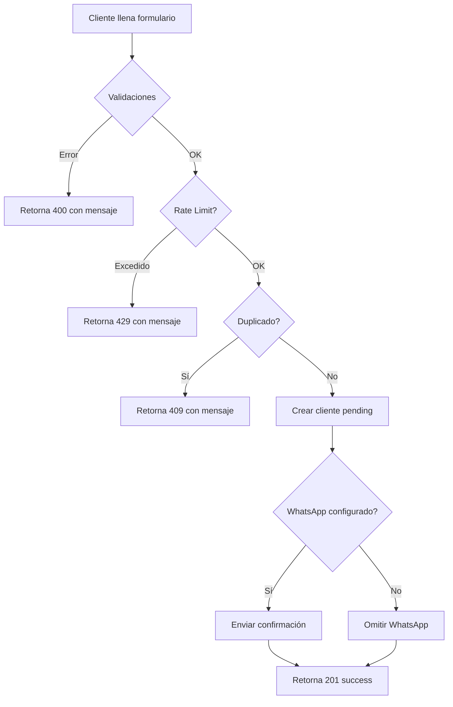

# ✅ FASE 2 COMPLETADA: Edge Function Auto-Registro Cliente

## 📋 Resumen Ejecutivo

Se implementó exitosamente la edge function `auto-registro-cliente` que maneja el backend del formulario público de registro de clientes.

---

## 🚀 Edge Function Desplegada

**Nombre:** `auto-registro-cliente`
**Método:** `POST`
**Autenticación:** No requiere JWT (pública)
**URL:** `{SUPABASE_URL}/functions/v1/auto-registro-cliente`

---

## 📥 Request Body

```typescript
{
  company_id: string;           // UUID de la empresa
  nombre_fantasia: string;      // Nombre comercial (requerido)
  razon_social: string;         // Razón social (requerido)
  tipo_documento: 'DNI' | 'CUIT' | 'CUIL';  // Tipo de documento (requerido)
  numero_documento: string;     // Número de documento (requerido)
  whatsapp: string;             // Número de WhatsApp (requerido)
  email?: string;               // Email (opcional)
  domicilio?: string;           // Domicilio (opcional)
  frontend_origin?: string;     // Para tracking (opcional)
}
```

---

## ✅ Validaciones Implementadas

### 1. Validación de Campos Obligatorios
- ✅ Verifica que todos los campos requeridos estén presentes
- ✅ Retorna error 400 si faltan campos

### 2. Validación de Tipo de Documento
- ✅ Solo acepta: `DNI`, `CUIT`, `CUIL`
- ✅ Retorna error descriptivo si el tipo es inválido

### 3. Validación de Número de Documento
```typescript
DNI:  7 u 8 dígitos numéricos
CUIT: 11 dígitos numéricos
CUIL: 11 dígitos numéricos
```
- ✅ Limpia espacios y guiones automáticamente
- ✅ Retorna error específico según el tipo

### 4. Validación de WhatsApp
- ✅ Debe tener al menos 10 dígitos
- ✅ Acepta formatos: `+5491112345678`, `91112345678`, `01112345678`
- ✅ Formateo automático a formato internacional: `5491112345678`
- ✅ Limpia espacios, guiones y paréntesis

### 5. Validación de Email (Opcional)
- ✅ Si se proporciona, valida formato correcto
- ✅ Acepta null o undefined (campo opcional)

---

## 🛡️ Rate Limiting

### Configuración:
- **Límite:** 10 intentos por hora por IP
- **Tiempo de bloqueo:** 60 minutos
- **Reset automático:** Después de 1 hora sin intentos

### Flujo de Rate Limiting:

1. **Primer intento:** Se crea registro en `cliente_registro_intentos`
2. **Intentos 2-10:** Se incrementa el contador
3. **Intento 11+:** Se bloquea la IP por 60 minutos
4. **Después de 1 hora:** El contador se resetea automáticamente

### Respuestas:

**Bloqueado:**
```json
{
  "success": false,
  "error": "Ha superado el límite de 10 intentos por hora. Intente nuevamente en 60 minutos."
}
```

**Aún bloqueado:**
```json
{
  "success": false,
  "error": "Demasiados intentos. Intente nuevamente en X minutos."
}
```

---

## 🔍 Verificación de Duplicados

La función verifica si ya existe un cliente con el mismo documento en la empresa.

### Respuestas según status:

| Status | Mensaje |
|--------|---------|
| `pending` | "Tu solicitud de registro ya está siendo procesada. Por favor espera la confirmación." |
| `rejected` | "Tu solicitud de registro fue rechazada. Por favor contacta con la empresa para más información." |
| `approved` | "Ya tienes una cuenta activa con este documento." |

**HTTP Status:** 409 Conflict

---

## 📝 Creación del Cliente

### Datos guardados:

```typescript
{
  company_id: string;
  nombre_fantasia: string;      // Trimmed
  razon_social: string;         // Trimmed
  tipo_documento: string;
  numero_documento: string;     // Limpio (sin espacios ni guiones)
  whatsapp: string;            // Formateado a internacional
  email: string | null;        // Trimmed o null
  domicilio: string | null;    // Trimmed o null
  status_aprobacion: 'pending'; // Siempre pending
  is_active: false;            // Inactivo hasta aprobación
  tiene_cuenta_corriente: false;
  fecha_registro: timestamptz;  // Fecha actual
  ip_registro: string;         // IP del cliente
}
```

---

## 📱 Notificación WhatsApp al Cliente

### Flujo de Envío:

1. ✅ Verifica que la empresa tiene WhatsApp configurado
2. ✅ Verifica que el backend de WhatsApp está conectado
3. ✅ Genera mensaje de confirmación
4. ✅ Envía mensaje al WhatsApp del cliente
5. ✅ Retorna si el mensaje fue enviado exitosamente

### Mensaje de Confirmación:

```
Hola {nombre_cliente}!

Gracias por registrarte en *{nombre_empresa}*.

Tu solicitud de registro ha sido recibida y está siendo revisada por nuestro equipo.

En breve recibirás una confirmación cuando tu cuenta sea aprobada.

¡Gracias por tu paciencia!
```

---

## 📤 Respuestas de la API

### ✅ Registro Exitoso (201 Created)

```json
{
  "success": true,
  "message": "Registro exitoso. Tu solicitud está siendo revisada.",
  "cliente_id": "uuid-del-cliente",
  "whatsapp_enviado": true
}
```

### ❌ Error de Validación (400 Bad Request)

```json
{
  "success": false,
  "error": "Descripción del error de validación"
}
```

**Ejemplos:**
- "Todos los campos obligatorios deben ser completados"
- "Tipo de documento inválido"
- "DNI debe tener 7 u 8 dígitos"
- "CUIT debe tener 11 dígitos"
- "Número de WhatsApp inválido"
- "Email inválido"

### ❌ Cliente Duplicado (409 Conflict)

```json
{
  "success": false,
  "error": "Ya existe un cliente registrado con este documento."
}
```

### ❌ Rate Limit Excedido (429 Too Many Requests)

```json
{
  "success": false,
  "error": "Ha superado el límite de 10 intentos por hora. Intente nuevamente en 60 minutos."
}
```

### ❌ Empresa No Encontrada (404 Not Found)

```json
{
  "success": false,
  "error": "Empresa no encontrada"
}
```

### ❌ Error Interno (500 Internal Server Error)

```json
{
  "success": false,
  "error": "Error al registrar el cliente. Por favor intente nuevamente."
}
```

o

```json
{
  "success": false,
  "error": "Error interno del servidor"
}
```

---

## 🔒 Seguridad Implementada

### 1. Rate Limiting por IP
- ✅ Protección contra spam
- ✅ Prevención de ataques de fuerza bruta
- ✅ Límite de 10 intentos por hora

### 2. Validaciones Robustas
- ✅ Todos los campos son sanitizados
- ✅ Documentos validados según formato argentino
- ✅ WhatsApp formateado automáticamente
- ✅ Email validado con regex

### 3. Verificación de Duplicados
- ✅ No permite registros con el mismo documento
- ✅ Mensajes específicos según el estado del cliente existente

### 4. Registro de Auditoría
- ✅ IP del cliente registrada
- ✅ Fecha y hora exacta del registro
- ✅ Trazabilidad completa

### 5. CORS Configurado
- ✅ Permite solicitudes desde cualquier origen
- ✅ Soporta preflight OPTIONS
- ✅ Headers correctos configurados

---

## 🧪 Testing de la Función

### Test 1: Registro Exitoso

```bash
curl -X POST \
  'https://your-project.supabase.co/functions/v1/auto-registro-cliente' \
  -H 'Content-Type: application/json' \
  -d '{
    "company_id": "uuid-de-empresa",
    "nombre_fantasia": "Imprenta Test",
    "razon_social": "Imprenta Test SA",
    "tipo_documento": "CUIT",
    "numero_documento": "20-12345678-9",
    "whatsapp": "+54 911 1234-5678",
    "email": "test@example.com",
    "domicilio": "Av. Siempre Viva 123"
  }'
```

**Respuesta esperada:** 201 Created

### Test 2: Campo Faltante

```bash
curl -X POST \
  'https://your-project.supabase.co/functions/v1/auto-registro-cliente' \
  -H 'Content-Type: application/json' \
  -d '{
    "company_id": "uuid-de-empresa",
    "nombre_fantasia": "Imprenta Test"
  }'
```

**Respuesta esperada:** 400 Bad Request

### Test 3: Documento Inválido

```bash
curl -X POST \
  'https://your-project.supabase.co/functions/v1/auto-registro-cliente' \
  -H 'Content-Type: application/json' \
  -d '{
    "company_id": "uuid-de-empresa",
    "nombre_fantasia": "Imprenta Test",
    "razon_social": "Imprenta Test SA",
    "tipo_documento": "DNI",
    "numero_documento": "123",
    "whatsapp": "1112345678"
  }'
```

**Respuesta esperada:** 400 Bad Request - "DNI debe tener 7 u 8 dígitos"

### Test 4: Rate Limiting

Ejecutar 11 veces seguidas el Test 1 con la misma IP.

**Respuesta esperada en intento 11:** 429 Too Many Requests

---

## 📊 Métricas y Monitoreo

### Logs a Revisar:

1. **Rate Limit:**
   ```
   [Rate Limit] Error consultando intentos: {error}
   ```

2. **Duplicados:**
   ```
   [Duplicado] Error verificando: {error}
   ```

3. **WhatsApp:**
   ```
   [WhatsApp] Error verificando estado: {error}
   [WhatsApp] Error enviando mensaje: {error}
   ```

4. **Creación:**
   ```
   [Cliente] Error creando: {error}
   ```

5. **General:**
   ```
   [Error General]: {error}
   ```

### Queries Útiles:

**Clientes pendientes hoy:**
```sql
SELECT COUNT(*)
FROM clients
WHERE status_aprobacion = 'pending'
  AND DATE(fecha_registro) = CURRENT_DATE;
```

**Intentos bloqueados:**
```sql
SELECT ip_address, company_id, intentos, bloqueado_hasta
FROM cliente_registro_intentos
WHERE bloqueado_hasta > now();
```

**Registros por hora:**
```sql
SELECT
  DATE_TRUNC('hour', fecha_registro) as hora,
  COUNT(*) as registros
FROM clients
WHERE fecha_registro > now() - interval '24 hours'
GROUP BY hora
ORDER BY hora DESC;
```

---

## 🎯 Flujo Completo de Registro



---

## 🔄 Integración con Frontend

### Ejemplo de Llamada desde React:

```typescript
async function registrarCliente(data: ClienteRegistroData) {
  try {
    const response = await fetch(
      `${import.meta.env.VITE_SUPABASE_URL}/functions/v1/auto-registro-cliente`,
      {
        method: 'POST',
        headers: {
          'Content-Type': 'application/json',
        },
        body: JSON.stringify(data),
      }
    );

    const result = await response.json();

    if (!response.ok) {
      throw new Error(result.error || 'Error al registrar');
    }

    return result;
  } catch (error) {
    console.error('Error:', error);
    throw error;
  }
}
```

---

## 📝 Notas Técnicas

### Formateo de WhatsApp:
- Acepta: `+5491112345678`, `91112345678`, `01112345678`, `11 1234-5678`
- Retorna: `5491112345678` (formato internacional limpio)

### Limpieza de Documentos:
- Entrada: `20-12345678-9`
- Salida: `20123456789`

### Manejo de Errores:
- Rate limiting: Si falla, permite el registro (fail-open)
- Duplicados: Si falla la consulta, permite el registro
- WhatsApp: Si falla, el registro continúa (no bloqueante)

---

## ✅ FASE 2 COMPLETADA

**Fecha de implementación:** 2025-12-03
**Edge Function desplegada:** `auto-registro-cliente`
**Estado:** ✅ Desplegada y funcionando
**Rate Limit configurado:** 10 intentos/hora
**Listo para:** Fase 3 - Formulario Público Móvil

---

## 🎯 Próximos Pasos

### Fase 3: Formulario Público Móvil
- Diseño mobile-first responsive
- Validaciones en tiempo real
- Feedback visual claro
- Pantallas de éxito/error
- Link público accesible sin autenticación
